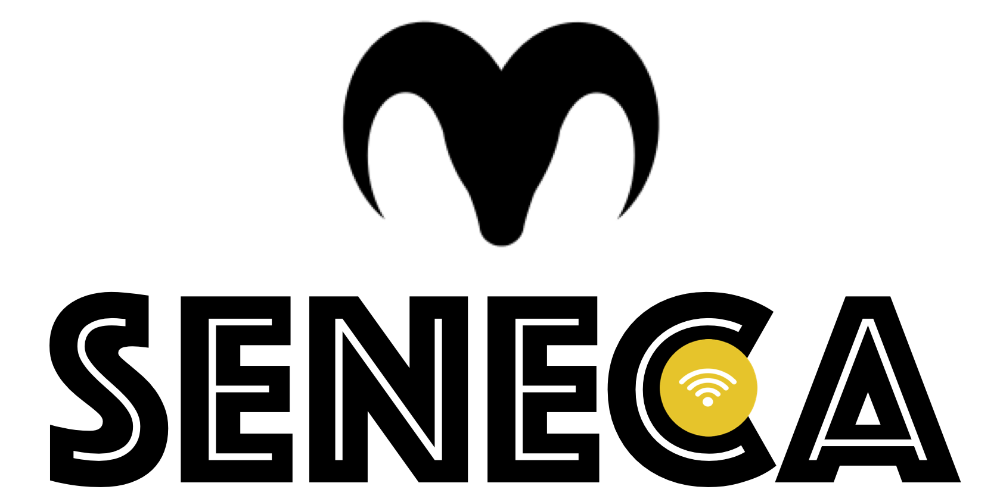

**seneca** is a simple OS X app to automate the boring process of login to the main WiFi network at Universidad de los Andes. If you like **seneca** please :star: it!

## Features

When you install `seneca`, the app would keep the current state of your connection and the networks you can join to. Whenever `seneca` sees the SENECA network (Uniandinos understand this), it'll try hard to join to it using the credentials you provide once. If `seneca` detects that the SENECA network is reachable, then you'll never see that ugly pop-up hotspot web interface we're all used to.

All this magic is achieved by using the least computational resources. Your credentials would be save, and your computer battery would be Ok.

## Install

## Development

### Contribution

This program is not complete by any means. There is a lot to be done to improve the current state of `seneca`. Please feel free to contribute and build on top of it. If you have any question, please feel free to contact us (see contact section).

Some suggestions to help us if you like the idea of safety and you're an Uniandino hacker are:

* Build a `seneca` based app for Windows (with the requirements of safety and low battery consumption)
* Build a `seneca` based app for Linux (with the requirements of safety and low battery consumption). It would be better to build it as a daemon process to avoid dealing with different Linux desktop environments. Anyway, if someone is brave enough to use a Linux distro under the current constraints and conditions of our education as "Ingenieros de Sistemas", he/she would be brave enough to install a `seneca` based daemon app.
* Improve the user experience, while keeping safety and battery consumption levels lowest as possible.
* Build a general app to work as `seneca` under any web based hot-spot.

### How to build

`seneca` uses Swift3.0, XCode and Cocoa framework to build a native app for OS X. The requirements are few: an Apple computer, the latest version of XCode installed and a developer account (provide support for non-standard libraries used by `seneca`). The instructions are:

### TODO
- [x] Change menu with the current options
- [x] Add shortcut text and function to 'Quit' button
- [x] Add shortcut text and function to 'Preferences' button
- [X] Add 'About Us' view
- [x] Add 'Preferences' view
- [x] Save/Load credentials and checkbox in preferences
- [x] Add status (text + icon) to menu
- [x] Add header title to 'Preferences' view
- [x] Add header title to 'About Us' view
- [x] Close when click on 'Quit' button
- [ ] Start on login if configured as such
- [x] Check if SSID == SENECA
- [ ] Check if its connected to SENECA
- [ ] Listen to connection changes on WiFi
- [ ] Check connection every X time
- [ ] Perform automatic connection with credentials

## Contact

If you find a bug, please [open an issue](https://github.com/jcbages/seneca/issues/new).

seneca is maintained by [Juan Camilo Bages](https://github.com/jcbages) and [Sebastián Valencia](https://github.com/scvalencia).

